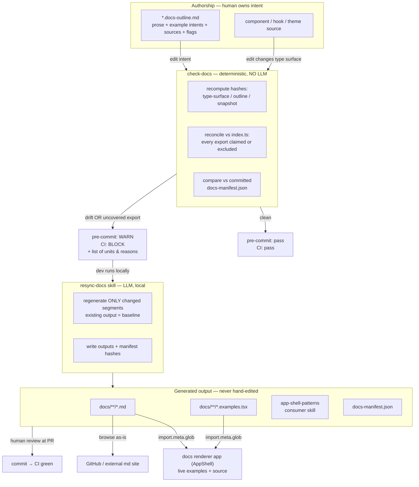

# Documentation Management Overhaul

## Context

Today all ~65 docs (`docs/components/` ×37, `docs/api/` ×22, `docs/concepts/` ×6) are maintained by hand, with no enforced link between a component's source and its doc. Nothing detects when an API changes but its doc doesn't — drift is invisible. There's a live example of the failure right now: `timeline.tsx` has a component, a test, **and** `docs/components/timeline.md`, yet it isn't exported from `index.ts` — a documented component consumers can't import.

An existing agentic workflow (`.github/workflows/docs-update.lock.yml`) patches drift _after_ changesets merge to `main`, but it's heuristic, non-deterministic, and post-merge (drift lands first).

**Goal:** a one-way `source → output` docs pipeline with clear human/AI author points, deterministic drift gates that block _before_ merge, regeneration only when the interface or authored intent actually changes, and a browsable site with live in-place examples alongside their source.

This plan was designed interactively; every decision below reflects an explicit choice by the maintainer.

---

## Authorship model (Goal #1: clear human/AI author points)

| Surface                                                                                          | Owner                                                                       | Editable by hand?                     |
| ------------------------------------------------------------------------------------------------ | --------------------------------------------------------------------------- | ------------------------------------- |
| `*.docs-outline.md` — prose (verbatim) + English example intents + `sources` + flags             | **Human owns intent** (AI may draft; human curates & approves at PR review) | ✅ the **only** hand-editable surface |
| `docs/**/[unit].md`, `[unit].examples.tsx`, `docs-manifest.json`, the `app-shell-patterns` skill | **AI synthesizes** (`resync-docs`), human reviews the diff                  | ❌ never                              |

One rule: **humans edit intent (outlines); AI produces everything downstream; nothing generated is ever hand-edited.**

---

## Core model (resolved decisions)

| Dimension                      | Decision                                                                                                                                                                                                                                                                                                                                                                 |
| ------------------------------ | ------------------------------------------------------------------------------------------------------------------------------------------------------------------------------------------------------------------------------------------------------------------------------------------------------------------------------------------------------------------------ |
| **Doc inclusion signal**       | **Explicit**: a unit exists because a `*.docs-outline.md` claims it. Reconciled against `index.ts` (see Coverage below). **Folders are NOT the signal** — folderization is a free code-organization choice, decoupled from docs.                                                                                                                                         |
| **Scope**                      | Public surface (exported from `index.ts`). Internal-only files need no outline and may be folder-grouped freely without implying documentation.                                                                                                                                                                                                                          |
| **Doc unit / grouping**        | A unit = one output doc. Its `docs-outline.md` (colocated with the anchor source) declares a `sources:` glob list that may span `components/`, `hooks/`, `lib/`, `contexts/`, `types/` — so a unit can gather cross-cutting, even _shared_, code (e.g. `collection` types shared across DataTable/Kanban/Gantt).                                                         |
| **Output location**            | Inferred from where the outline lives: `components/…` → `docs/components/`, `hooks/…` → `docs/api/`, `docs-src/concepts/…` → `docs/concepts/`, etc. Slug from a `group`/filename.                                                                                                                                                                                        |
| **Change signal**              | **Blocking:** type-surface hash + outline hash. **Advisory (non-blocking):** test-snapshot hash.                                                                                                                                                                                                                                                                         |
| **Examples**                   | Per unit: one runnable **`[unit].examples.tsx`** with keyed named exports; the `.md` code fences are **derived deterministically** by extracting those exports. Compiles in CI. Per-segment keys ⇒ regenerate only the changed example, reuse the rest as baseline.                                                                                                      |
| **Docs site**                  | A dedicated **AppShell-based renderer app** (dogfooding). Build-time `import.meta.glob` + lazy dynamic import of the canonical `docs/**/*.{md,examples.tsx}` — imports in place, **no copy**. Dev serves from source w/ HMR; prod bundles.                                                                                                                               |
| **Fix path**                   | Deterministic pre-merge `check-docs` gate (**no LLM**) blocks the PR on drift. The local `resync-docs` skill is the **only** fix path. `docs-update.lock.yml` is **retired**. Pre-commit _warns_; CI _blocks_.                                                                                                                                                           |
| **Non-component docs**         | Unified source→output; the whole `docs/` output tree is 100% generated. Hooks = code-backed units. Concepts/patterns = prose outlines in `docs-src/` (outline-hash trigger only; may embed live-example tokens). Tokens = code-backed from theme CSS. Re-exports = lightweight **reference units** (prose + upstream link; claim symbols by name; no type-surface hash). |
| **Drift baseline & integrity** | The **committed `docs-manifest.json`** stores per unit: output path, `sources` globs, the **input** hashes (type-surface/outline/snapshot) **and output** hashes (`.md` + `examples.tsx`). `check-docs` recomputes and compares — no git-history diffing. Input drift ⇒ needs resync; **output-hash mismatch ⇒ a generated file was hand-edited ⇒ CI fail**.             |
| **Migration**                  | AI **reverse-generates** outlines + `examples.tsx` + manifest from the existing docs; humans curate/restructure; enforcement phases in per-unit.                                                                                                                                                                                                                         |
| **`app-shell-patterns`**       | A **consumer-facing build skill** synthesized from component interfaces + pattern docs, manifest-tracked, resynced when upstream drifts.                                                                                                                                                                                                                                 |

---

## Workflow



---

## Coverage reconciliation (the anti-drift core — answers "what if I forget?")

`check-docs` treats `index.ts` as the source of truth for the public surface and reconciles it **both ways**:

```
for each export E in index.ts:
    claimed  = a code-backed unit's `sources` resolves to E
               OR a reference outline's `claims` lists E by name
    excluded = E is in docs.config.ts exclusions (rare escape hatch only)
    if not (claimed or excluded):  → BLOCK  "E is exported but undocumented"

for each code-backed unit U:
    for each public symbol U documents:
        if symbol not exported from index.ts:  → BLOCK  "U documents non-exported symbol"  (the timeline case)
```

So adding a new exported hook and forgetting to claim it **fails CI** with a specific message; you must add it to a unit's `sources`, a reference outline's `claims`, or (rarely) the escape-hatch exclusions. `sources` is never a trust-me allowlist.

Coverage applies to everything exported from `index.ts`: **code-backed units** satisfy it via `sources`; **reference units** (re-exports) satisfy it via `claims` (by name) but carry no type-surface hash. Prose concepts/patterns aren't in the public surface, so they're outside coverage entirely — triggered solely by their own outline hash.

**Code-backed outline frontmatter:**

```yaml
---
group: data-table # slug → docs/components/data-table.md (category from outline location)
sources:
  - packages/core/src/components/data-table/**
  - packages/core/src/hooks/use-collection-variables.ts
  - packages/core/src/lib/collection-url-state.ts
  - packages/core/src/contexts/collection-control-context.tsx
  - packages/core/src/types/collection.ts
---
```

**Reference outline frontmatter** (re-exports we don't own — light mention + pointer, no type surface):

```yaml
---
group: react-router # docs-src/references/ → docs/references/react-router.md
upstream: https://reactrouter.com/
claims: [useNavigate, useParams, useLocation, useSearchParams, useRouteError, Link]
---
```

Prose is copied verbatim; example segments are keyed English tokens, e.g.
`<!-- example: basic-usage --> A DataTable with pagination and a filter toolbar.`

---

## Directory layout & packaging (answers "new package?")

**Yes — keep all tooling out of the published `core` bundle.**

```
packages/core/src/**/[unit].docs-outline.md   ← authored source, colocated; not published (core ships only dist/** + skills/**, so src/ never ships — no extra config)
packages/docs-kit/                            ← NEW private (unpublished) workspace pkg:
    type-surface extractor (reuses ts-morph, already a dep in vite-plugin)
    check-docs • manifest gen • md assembler (prose + extracted fences)
docs-src/concepts|patterns|tokens/*.docs-outline.md   ← authored prose outlines (no code home)
docs-src/references/*.docs-outline.md                 ← re-export reference outlines (claims by name + upstream link)

docs/**/[unit].md, docs/**/[unit].examples.tsx        ← generated output (repo root, as today)
docs/docs-manifest.json                               ← committed generated baseline
docs.config.ts                                        ← exclusions list + location→category rules

examples/docs-app/                            ← NEW AppShell renderer app (dogfoods app-shell)
examples/vite-app/                            ← STRIPPED to a minimal AppShell MVP (see below)
.agents/skills/resync-docs/                   ← NEW local LLM skill
```

- **Vite example app is stripped back** to a minimal reference AppShell implementation; its current demo pages (which informally served as examples) are removed — examples now live in `[unit].examples.tsx` and are shown in the docs-app.
- The `app-shell-patterns` consumer skill is generated into **`packages/core/skills/`** — already published to consumers via core's existing `files: ["skills/**"]`, so it ships with the npm package (dir doesn't exist yet; the pipeline creates it).

---

## Pieces to build

1. **Type-surface extractor + hasher** (`packages/docs-kit`): per unit, resolve `sources` → intersect (`index.ts` exports) ∩ (declarations in sources) → serialize signatures deterministically → hash. Ignores comments/refactors/formatting.
2. **`check-docs`** (deterministic, no LLM): recompute hashes, run coverage reconciliation, compare to manifest. Blocking = type-surface/outline mismatch, uncovered export, missing/stale output, **or an output-hash mismatch (a generated file was hand-edited)**. Advisory = snapshot mismatch (prints, never fails). Emits unit list + reasons; non-zero exit in CI.
3. **`resync-docs`** skill (LLM, local): input optional unit list (else runs `check-docs`); per unit read current output as baseline, classify what changed, regenerate only affected segments, reassemble `.md`, refresh type tables, rewrite manifest hashes. Also re-evaluates the `app-shell-patterns` skill on upstream drift.
4. **Docs renderer app** (`examples/docs-app`): `import.meta.glob` → one AppShell resource per unit; renders prose + at each token the live component (from `examples.tsx`) and its extracted source. Dev needs `server.fs.allow` for `docs/` + tsconfig include so examples type-check against `@tailor-platform/app-shell`.
5. **CI + hooks**: add `check-docs` turbo task to `ci-packages.yaml` (blocks); type-check `docs/**/*.examples.tsx` against core; `lefthook.yml` pre-commit runs `check-docs` in **warn** mode; **delete** `docs-update.lock.yml`.

---

## Execution phases

1. **Pilot / POC (first)** — implement the full pipeline end-to-end against **2–3 representative components** (e.g. `Button` single-file, `DataTable` multi-dir/shared-types, `Sidebar` compound) **+ 1–2 patterns**. Proves extractor, gate, coverage, examples, renderer, and skill before scaling. Iterate on the outline/manifest format here.
2. **Build-out** — `docs-kit`, `check-docs`, `resync-docs`, renderer app, CI wiring, strip the Vite example app, retire the bot.
3. **Migration** — AI reverse-generates all remaining outlines + `examples.tsx` + manifest; humans curate; coverage enforcement flips to "all public exports required."

---

## Verification

1. **Extractor unit tests:** comment-only/refactor edit → type-surface hash stable; prop added/removed → changes; class-only tweak → type-surface stable, snapshot advisory fires.
2. **`check-docs` golden cases:** clean tree → exit 0; mutate a prop type → block naming the unit; edit outline prose → block; class tweak → advisory only, exit 0; **add an exported hook with no outline → block** (the forgetting case); **`timeline` → block** (documented, not exported); **hand-edit a generated `.md`/`examples.tsx` → block** (output-hash mismatch).
3. **Examples compile:** break a generated `examples.tsx` (removed prop) → CI type-check fails.
4. **Renderer app:** `preview_start` the docs-app; a unit page shows live component + matching source; edit an `examples.tsx` in dev → HMR updates with no copy step; `.md` fence === rendered example.
5. **Idempotency:** `resync-docs` on a clean tree → zero diffs; change one prop → exactly one unit resyncs.

---

## Implementation notes (from the POC pilot)

The pilot (`packages/docs-kit` + Button/Dialog/DataTable + form-modal/list-dense-scan + `examples/docs-app`) validated the design and surfaced these concrete details:

- **Prop tables are auto-generated** from the resolved type surface. `docs-kit` lists a `*Props` symbol's **first-party** props only — members whose declaration resolves into `node_modules` (e.g. the ~250 DOM attributes from `React.ComponentProps<"button">`) are filtered out, leaving the props the component actually adds (`variant`, `size`, `render`, …) with their JSDoc. An `<!-- api -->` token in an outline places the generated `## Props` + `## Exports`; otherwise they append. **TODO:** default values aren't extracted yet (they live in cva `defaultVariants` / destructuring defaults, not the type) — capture via an `@default` JSDoc tag or cva parsing.
- **`astw:` is app-shell's INTERNAL Tailwind prefix** — for the library's own components and its shipped stylesheet only. **Consumers (and therefore all generated example code) use ordinary, unprefixed Tailwind.** The new `docs/concepts/styling.md` documents the consumer setup (`@tailwindcss/vite` + `@import "tailwindcss"` then app-shell `styles`/theme); the docs-app is wired exactly that way as the reference.
- **Examples live at repo-root `docs/`, outside any package**, so their bare imports don't resolve against a package's `node_modules` by default. Two wiring details make them type-check and run:
  - docs-app **tsconfig** uses `baseUrl` + **end-anchored** `paths` regexes mapping the exact specifiers (`@tailor-platform/app-shell`, `react`, `lucide-react`) to the app's deps — end-anchored so subpath imports like `@tailor-platform/app-shell/styles` still resolve via package `exports`. Core has **no top-level `types`** field (only inside `exports`), so the app-shell path points straight at `dist/app-shell.d.ts`.
  - docs-app **Vite** resolves the out-of-tree examples' bare imports via a **`docs/`-scoped `resolveId` plugin** (see the AppShell bullet), keeps a narrow alias only for `@tailor-platform/app-shell-vite-plugin/parser` (core's bundle imports it via `createTypedPaths`, so that package must be built), `dedupe: ["react","react-dom"]`, and Tailwind `@source "../../../docs/**/*.examples.tsx"` so example utility classes are generated.
- **The docs-app is a real `<AppShell>` app** using file-based routing (the "automagic"). One thin `src/pages/**/page.tsx` per unit renders a shared `DocPage` (markdown + live examples); `<AppShell><SidebarLayout sidebar={<DefaultSidebar />} /></AppShell>` infers routes **and** the grouped sidebar automatically from the page structure + `appShellPageProps.meta` — no `modules` prop, no manual `SidebarItem`s. This also brings breadcrumbs, the command palette, and the theme switcher for free. The out-of-tree examples resolve via a **`docs/`-scoped Vite `resolveId` plugin** (not a global alias — a global `@tailor-platform/app-shell` alias would clash with the routing plugin's `entrypoint` interception of `App.tsx`). Follow-up: `docs-kit` could generate the per-unit `page.tsx` stubs so new units appear with zero manual wiring.
- **`sync` formats its outputs + sources with oxfmt _before_ hashing**, so the committed bytes match the manifest and the pre-commit oxfmt hook is idempotent (it can never reformat a generated file after the fact and silently break the gate). Hashes are also whitespace-normalized as a second line of defense. This was a real bite during the pilot: oxfmt reformats code _inside_ generated `.md` fences, which a whitespace-only normalization doesn't absorb.
- **Sources are `git mv`'d, not invented.** Component outlines are moved from the hand-written `docs/components/*.md` (a prep commit, preserving `git log --follow` lineage); the generated `docs/components/*.md` then land as new files. Patterns are moved from **`catalogue/src/pattern/`** (`form/modal` → `form-modal`, `list/dense-scan` → `list-dense-scan`) — their `PATTERN.md` becomes the outline and the example `.tsx` becomes the runnable example, then both are adapted to the docs-kit format. Catalogue already generates the `app-shell-patterns` skill; the intent is for docs-kit to **subsume** that (generate the skill from these docs) and retire catalogue's pipeline, so catalogue's generator/tests are knowingly left to regress for now.

## Optional / follow-up (not blocking)

- **Internal reorg** — move single-consumer internals into their consumer's folder; bucket framework internals under `app-shell/`/`internals/`. Now purely cosmetic (the `sources` globs make it irrelevant to docs), so a separate cleanup PR.
- **Public docs-site polish** (SEO/search/hosting/prerender) — only if a public-facing site is wanted.
