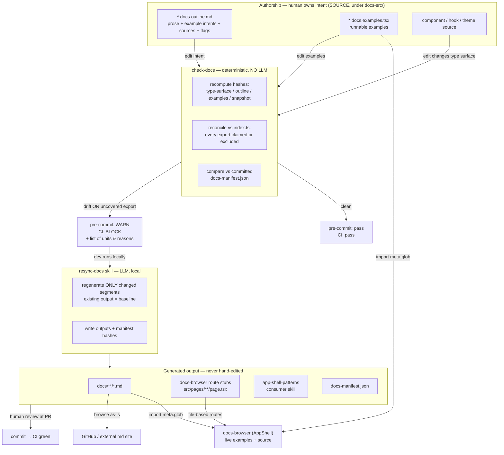

# Documentation Management Overhaul

## Context

Today all ~65 docs (`docs/components/` ×37, `docs/api/` ×22, `docs/concepts/` ×6) are maintained by hand, with no enforced link between a component's source and its doc. Nothing detects when an API changes but its doc doesn't — drift is invisible. The failure that motivated this design: `timeline.tsx` shipped a component, a test, **and** `docs/components/timeline.md`, yet was never exported from `index.ts` — a documented component consumers couldn't import. (It has since been exported and migrated to a docs-kit unit; the reverse coverage check below is what now catches this class of bug.)

An existing agentic workflow (`.github/workflows/docs-update.lock.yml`) patches drift _after_ changesets merge to `main`, but it's heuristic, non-deterministic, and post-merge (drift lands first).

**Goal:** a one-way `source → output` docs pipeline with clear human/AI author points, deterministic drift gates that block _before_ merge, regeneration only when the interface or authored intent actually changes, and a browsable site with live in-place examples alongside their source.

This plan was designed interactively; every decision below reflects an explicit choice by the maintainer.

---

## Authorship model (Goal #1: clear human/AI author points)

| Surface                                                                                                                                                                           | Owner                                                                       | Editable by hand?                      |
| --------------------------------------------------------------------------------------------------------------------------------------------------------------------------------- | --------------------------------------------------------------------------- | -------------------------------------- |
| `*.docs.outline.md` — prose (verbatim) + English example intents + `sources` + flags, **and** `*.docs.examples.tsx` — runnable examples (both authored SOURCE, under `docs-src/`) | **Human owns intent** (AI may draft; human curates & approves at PR review) | ✅ the **only** hand-editable surfaces |
| `docs/**/[unit].md`, `docs-manifest.json`, the docs-browser route stubs (`docs-browser/src/pages/**/page.tsx`), the `app-shell-patterns` skill                                    | **AI synthesizes** (`resync-docs`), human reviews the diff                  | ❌ never                               |

One rule: **humans edit intent (outlines + examples, under `docs-src/`); AI produces everything under `docs/` (and the browser route stubs) downstream; nothing generated is ever hand-edited.**

---

## Core model (resolved decisions)

| Dimension                      | Decision                                                                                                                                                                                                                                                                                                                                                                                                                                                                                                                                                                                                                                                                |
| ------------------------------ | ----------------------------------------------------------------------------------------------------------------------------------------------------------------------------------------------------------------------------------------------------------------------------------------------------------------------------------------------------------------------------------------------------------------------------------------------------------------------------------------------------------------------------------------------------------------------------------------------------------------------------------------------------------------------- |
| **Doc inclusion signal**       | **Explicit**: a unit exists because a `*.docs.outline.md` claims it. Reconciled against `index.ts` (see Coverage below). **Folders are NOT the signal** — folderization is a free code-organization choice, decoupled from docs.                                                                                                                                                                                                                                                                                                                                                                                                                                        |
| **Unit kind**                  | **Declared, never derived.** Every outline states `kind: code-backed` or `kind: prose` in frontmatter. Code-backed ⇒ a `sources` glob list, an owned symbol set, a type-surface hash. Prose ⇒ none of those. Nothing about a unit's contract is inferred from its filename, its directory, or the presence of another key — a unit cannot change kind by accident.                                                                                                                                                                                                                                                                                                      |
| **Scope**                      | Public surface (exported from `index.ts`). Internal-only files need no outline and may be folder-grouped freely without implying documentation.                                                                                                                                                                                                                                                                                                                                                                                                                                                                                                                         |
| **Doc unit / grouping**        | A unit = one output doc. Its `docs.outline.md` (under `docs-src/`) declares a `sources:` glob list that may span `components/`, `hooks/`, `lib/`, `contexts/`, `types/` — so a unit can gather cross-cutting, even _shared_, code (e.g. `collection` types shared across DataTable/Kanban/Gantt).                                                                                                                                                                                                                                                                                                                                                                       |
| **Output location**            | Inferred from where the outline lives under `docs-src/`: `docs-src/components/…` → `docs/components/`, `docs-src/hooks/…` → `docs/api/`, `docs-src/concepts/…` → `docs/concepts/`, etc. The category is the one thing location decides; `group` (slug), `title` and `description` are **declared** in frontmatter, never defaulted from a filename or title-cased.                                                                                                                                                                                                                                                                                                      |
| **Change signal**              | **Blocking:** type-surface hash + outline hash. **Advisory (non-blocking):** test-snapshot hash.                                                                                                                                                                                                                                                                                                                                                                                                                                                                                                                                                                        |
| **Examples**                   | Per unit: one runnable **`[unit].docs.examples.tsx`** — authored SOURCE, a sibling of the outline under `docs-src/` — with keyed named exports; the `.md` code fences are **derived deterministically** by extracting those exports. Compiles in CI. Per-segment keys ⇒ regenerate only the changed example, reuse the rest as baseline.                                                                                                                                                                                                                                                                                                                                |
| **Docs site**                  | A dedicated **AppShell-based renderer app** (`docs-browser/`, dogfooding). Build-time `import.meta.glob` of the generated `docs/**/*.md` + the authored `**/*.docs.examples.tsx` — imports in place, **no copy**. Dev serves from source w/ HMR; prod bundles.                                                                                                                                                                                                                                                                                                                                                                                                          |
| **Fix path**                   | Deterministic pre-merge `check-docs` gate (**no LLM**) blocks the PR on drift. The local `resync-docs` skill is the **only** fix path. `docs-update.lock.yml` is **retired**. Pre-commit _warns_; CI _blocks_.                                                                                                                                                                                                                                                                                                                                                                                                                                                          |
| **Non-component docs**         | Unified source→output; most of `docs/` is generated, except the four hand-authored root docs (`introduction`, `quickstart`, `design-philosophy`, `migrations`) — and `migrations.md` doubles as an input to the skill generator. Hooks/api are **prose units** today (migrated verbatim; upgradable to code-backed with `sources` later). Concepts/patterns/pages = prose outlines in `docs-src/` (outline-hash trigger only; may embed live-example tokens). Re-exports we don't own are covered by `claims` on the prose unit that documents them — there is no third kind. CSS-token units and the `docs-src/references/` pages are **specified but not yet built**. |
| **Drift baseline & integrity** | The **committed `docs-manifest.json`** stores per unit: output path, `sources` globs, the **input** hashes (type-surface / outline / `*.docs.examples.tsx` / snapshot) **and** the generated-`.md` output hash. `check-docs` recomputes and compares — no git-history diffing. Input drift (incl. an examples edit that leaves the `.md` fences stale) ⇒ needs resync; **a hand-edited generated `.md` ⇒ output-hash mismatch ⇒ CI fail**.                                                                                                                                                                                                                              |
| **Migration**                  | AI **reverse-generates** outlines + `*.docs.examples.tsx` + manifest from the existing docs; humans curate/restructure; enforcement phases in per-unit.                                                                                                                                                                                                                                                                                                                                                                                                                                                                                                                 |
| **`app-shell-patterns`**       | A **consumer-facing build skill** emitted by `docs-kit sync` from the generated docs (components, hooks, patterns, pages, concepts) + the authored `SKILL.template.md`, manifest-tracked (hashed in `docs-manifest.json` under `skill`) and validated by `check-docs`. **Implemented** — it subsumes and replaces the retired `catalogue` generator.                                                                                                                                                                                                                                                                                                                    |

---

## Outline frontmatter (the authored contract)

Frontmatter is a **closed schema**, validated before anything else runs. Every field a unit's behaviour depends on is written down; none is guessed. An unrecognised key is an error, not a silent no-op — a mistyped `sourcs:` or `clams:` must never read as an absent one.

```yaml
---
kind: code-backed # REQUIRED — "code-backed" or "prose"
group: date-picker # REQUIRED — slug; output is <category>/<group>.md
title: DatePicker # REQUIRED
description: … # REQUIRED — one line; feeds the route stub + the consumer skill
sources: # REQUIRED iff kind is code-backed — FORBIDDEN on prose
  - packages/core/src/components/date-field/**
claims: [CalendarDate, parseDate, DateValue] # OPTIONAL, either kind — re-exports this page documents
upstream: https://react-spectrum.adobe.com/internationalized/date/ # OPTIONAL — pointer for claims
---
```

**`claims` is orthogonal to `kind`, not an alternative to it.** A code-backed unit hashes the first-party symbols its `sources` own _and_ claims the re-exports its prose covers — `date-picker` documents `DateField`/`DatePicker`/`DateRangePicker` from source and `CalendarDate`/`parseDate`/`DateValue` by name, because you cannot use the component without them. Splitting that across two pages to satisfy the reconciler would duplicate guidance the one page already gives. A claims-only prose unit is what the `docs-src/references/` pages are; they are not a distinct kind.

Pattern and page units additionally declare the presentation metadata the generated `app-shell-patterns` skill reads — `slug` (its catalogue display path), `name`, `category`, `subcategory`, `requiredImports`, `tags`, `do`, `dont`. These are part of the schema and read through typed fields, not an untyped `Record<string, unknown>` escape hatch.

**Validation (all blocking unless noted):**

| #   | Rule                                                          | Catches                                                            |
| --- | ------------------------------------------------------------- | ------------------------------------------------------------------ |
| 1   | `kind` absent, or not one of the two values                   | a unit with no declared contract                                   |
| 2   | Code-backed with no `sources`                                 | **a gated unit silently losing its gate** (see below)              |
| 3   | `sources` present on a prose unit                             | the inverse — globs that were never going to be hashed             |
| 4   | Any frontmatter key outside the schema                        | typos; keys the reader believes are live but nothing reads         |
| 5   | `group` / `title` / `description` absent                      | values that used to fall back to a filename or a title-cased slug  |
| 6   | A code-backed unit whose `sources` own zero exports           | the timeline-class bug (reverse coverage)                          |
| 7   | A claimed name not exported from `index.ts`                   | a claim gone stale after an upstream rename or a dropped re-export |
| 8   | A manifest entry with no live outline                         | an orphaned generated `.md` left behind by a deleted outline       |
| 9   | _(advisory)_ A claimed name that is first-party, not external | `claims` used where a `sources` glob would have stayed verified    |

**Rule 2 is the one that matters most.** Without it, the only thing standing between "this unit is gated" and "this unit is gated by nothing" is the forward coverage check — which is advisory until `enforceCoverage` flips, so during the migration phase a unit could stop being hashed and CI would stay green. Rule 2 catches it at parse time, unconditionally: the safety net is not coupled to the flag it is meant to back up.

**Rule 9 is advisory, not blocking,** because claiming by name is sometimes the lesser evil. `BadgeVariant` and `BadgeOptions` are declared in `components/badge-list/`; widening the badge unit's glob to reach them would drag in `BadgeList`'s whole surface too. That trade is a judgement call — it just shouldn't pass unremarked.

Declaring `kind` also puts a consequential change where review can see it. A unit that stops being hashed shows up as `- kind: code-backed` / `+ kind: prose` in an authored file's diff, rather than as a `typeSurface` quietly going `null` inside an 83-unit JSON blob.
||||||| BASE
| Dimension | Decision |
| ------------------------------ | ---------------------------------------------------------------------------------------------------------------------------------------------------------------------------------------------------------------------------------------------------------------------------------------------------------------------------------------------------------------------------------------------------------------------------------------------------------------------------------------------------------------------------------------------------- |
| **Doc inclusion signal** | **Explicit**: a unit exists because a `*.docs.outline.md` claims it. Reconciled against `index.ts` (see Coverage below). **Folders are NOT the signal** — folderization is a free code-organization choice, decoupled from docs. |
| **Scope** | Public surface (exported from `index.ts`). Internal-only files need no outline and may be folder-grouped freely without implying documentation. |
| **Doc unit / grouping** | A unit = one output doc. Its `docs.outline.md` (under `docs-src/`) declares a `sources:` glob list that may span `components/`, `hooks/`, `lib/`, `contexts/`, `types/` — so a unit can gather cross-cutting, even _shared_, code (e.g. `collection` types shared across DataTable/Kanban/Gantt). |
| **Output location** | Inferred from where the outline lives under `docs-src/`: `docs-src/components/…` → `docs/components/`, `docs-src/hooks/…` → `docs/api/`, `docs-src/concepts/…` → `docs/concepts/`, etc. Slug from a `group`/filename. |
| **Change signal** | **Blocking:** type-surface hash + outline hash. **Advisory (non-blocking):** test-snapshot hash. |
| **Examples** | Per unit: one runnable **`[unit].docs.examples.tsx`** — authored SOURCE, a sibling of the outline under `docs-src/` — with keyed named exports; the `.md` code fences are **derived deterministically** by extracting those exports. Compiles in CI. Per-segment keys ⇒ regenerate only the changed example, reuse the rest as baseline. |
| **Docs site** | A dedicated **AppShell-based renderer app** (`docs-browser/`, dogfooding). Build-time `import.meta.glob` of the generated `docs/**/*.md` + the authored `**/*.docs.examples.tsx` — imports in place, **no copy**. Dev serves from source w/ HMR; prod bundles. |
| **Fix path** | Deterministic pre-merge `check-docs` gate (**no LLM**) blocks the PR on drift. The local `resync-docs` skill is the **only** fix path. `docs-update.lock.yml` is **retired**. Pre-commit _warns_; CI _blocks_. |
| **Non-component docs** | Unified source→output; most of `docs/` is generated, except the four hand-authored root docs (`introduction`, `quickstart`, `design-philosophy`, `migrations`) — and `migrations.md` doubles as an input to the skill generator. Hooks/api are **prose units** today (migrated verbatim; upgradable to code-backed with `sources` later). Concepts/patterns/pages = prose outlines in `docs-src/` (outline-hash trigger only; may embed live-example tokens). CSS-token units and re-export **reference units** are **specified but not yet built**. |
| **Drift baseline & integrity** | The **committed `docs-manifest.json`** stores per unit: output path, `sources` globs, the **input** hashes (type-surface / outline / `*.docs.examples.tsx` / snapshot) **and** the generated-`.md` output hash. `check-docs` recomputes and compares — no git-history diffing. Input drift (incl. an examples edit that leaves the `.md` fences stale) ⇒ needs resync; **a hand-edited generated `.md` ⇒ output-hash mismatch ⇒ CI fail**. |
| **Migration** | AI **reverse-generates** outlines + `*.docs.examples.tsx` + manifest from the existing docs; humans curate/restructure; enforcement phases in per-unit. |
| **`app-shell-patterns`** | A **consumer-facing build skill** emitted by `docs-kit sync` from the generated docs + authored fundamentals (`docs-src/skill/`), manifest-tracked (hashed in `docs-manifest.json` under `skill`) and validated by `check-docs`. **Implemented** — it subsumes and replaces the retired `catalogue` generator. |

---

## Workflow



---

## Coverage reconciliation (the anti-drift core — answers "what if I forget?")

`check-docs` treats `index.ts` as the source of truth for the public surface and reconciles it **both ways**:

```
for each export E in index.ts:
    claimed  = a code-backed unit's `sources` resolves to E
               OR any unit's `claims` lists E by name
    excluded = E is in docs.config.json exclusions (rare escape hatch only)
    if not (claimed or excluded):  → BLOCK  "E is exported but undocumented"

for each code-backed unit U:
    for each public symbol U documents:
        if symbol not exported from index.ts:  → BLOCK  "U documents non-exported symbol"  (the timeline-class bug)
```

So adding a new exported hook and forgetting to claim it is **caught** with a specific message — today an advisory warning, and a hard CI failure once `enforceCoverage` is turned on (`docs.config.json` ships it `false` during the migration phase); you fix it by adding the export to a unit's `sources`, to a unit's `claims`, or (rarely) to the escape-hatch exclusions. `sources` is never a trust-me allowlist. The **reverse** checks — a unit whose `sources` own zero exports, or a unit documenting a symbol `index.ts` doesn't export — **always block**, regardless of `enforceCoverage`.

Coverage is satisfied two ways, and a unit may use both: `sources` resolves first-party symbols from their declaration files, and `claims` names symbols by hand. Re-exports **require** `claims` — `ownedSymbols` skips any symbol declared inside `node_modules`, so no glob can ever reach `CalendarDate` or `useNavigate` however it is written. Prose concepts and patterns that claim nothing aren't in the public surface at all, so they're outside coverage entirely — triggered solely by their own outline hash.

**A code-backed unit that also covers re-exports** (the common case for anything wrapping a third-party primitive):

```yaml
---
kind: code-backed
group: data-table # → docs/components/data-table.md (category from outline location)
title: DataTable
description: Sortable, filterable, paginated table bound to a collection
sources:
  - packages/core/src/components/data-table/**
  - packages/core/src/hooks/use-collection-variables.ts
  - packages/core/src/lib/collection-url-state.ts
  - packages/core/src/contexts/collection-control-context.tsx
  - packages/core/src/types/collection.ts
---
```

**A claims-only prose unit** — re-exports we don't own, a light mention plus a pointer, no type surface. _Specified; no `docs-src/references/` pages exist on the branch yet:_

```yaml
---
kind: prose
group: react-router # docs-src/references/ → docs/references/react-router.md
title: React Router
description: Routing primitives AppShell re-exports unchanged
upstream: https://reactrouter.com/
claims: [useNavigate, useParams, useLocation, useSearchParams, useRouteError, Link]
---
```

Prose is copied verbatim; example segments are keyed English tokens, e.g.
`<!-- example: basic-usage --> A DataTable with pagination and a filter toolbar.`

---

## Directory layout & packaging (answers "new package?")

**Yes — keep all tooling out of the published `core` bundle.**

```
docs-src/{components,hooks,concepts,patterns,references}/**/[unit].docs.outline.md   ← authored source: ALL doc sources live here, NOT colocated with components (keeps packages/core/src pure component code and lets docs.config.json roots be just ["docs-src"])
docs-src/**/[unit].docs.examples.tsx                                                 ← authored runnable examples (a sibling of the outline)
packages/docs-kit/                            ← NEW private (unpublished) workspace pkg:
    type-surface extractor (reuses ts-morph, already a dep in vite-plugin)
    check-docs • manifest gen • md assembler (prose + extracted fences)
docs-src/concepts|patterns|tokens/*.docs.outline.md   ← authored prose outlines (no code home)
docs-src/**/[pattern].docs.examples.tsx               ← authored examples for prose patterns
docs-src/references/*.docs.outline.md                 ← re-export reference outlines (claims by name + upstream link)

docs/**/[unit].md                             ← generated output (repo root, as today); examples are NOT here — they are authored source in src
docs/docs-manifest.json                       ← committed generated baseline
docs.config.json                              ← exclusions list + location→category rules + pagesDir (route-stub target)

docs-browser/                                 ← NEW top-level AppShell renderer app (dogfoods app-shell); src/pages/**/page.tsx route stubs are GENERATED by sync
examples/                                     ← consumer example app only (vite-app)
.agents/skills/resync-docs/                   ← NEW local LLM skill
```

- **`examples/` holds only consumer example apps** (a reference AppShell implementation); it no longer doubles as the docs surface — authored examples now live under `docs-src/` as `[unit].docs.examples.tsx` (source) and are shown in the `docs-browser` app.
- The `app-shell-patterns` consumer skill is generated into **`packages/core/skills/`** — already published to consumers via core's existing `files: ["skills/**"]`, so it ships with the npm package. It is git-ignored and (re)generated by `docs-kit sync` — `changeset:publish` runs `docs:sync` before `changeset publish` so the skill is packed into the tarball.

---

## Pieces to build

1. **Type-surface extractor + hasher** (`packages/docs-kit`): per unit, resolve `sources` → intersect (`index.ts` exports) ∩ (declarations in sources) → serialize signatures deterministically → hash. Ignores comments/refactors/formatting.
2. **`check-docs`** (deterministic, no LLM): validate every outline against the closed frontmatter schema, then recompute hashes, run coverage reconciliation, and compare to manifest. Schema violations are reported before hashing, so a malformed outline names its own problem instead of surfacing as downstream drift. Blocking = type-surface/outline mismatch, uncovered export, missing/stale output, **or an output-hash mismatch (a generated file was hand-edited)**. Advisory = snapshot mismatch (prints, never fails). Emits unit list + reasons; non-zero exit in CI.
3. **`resync-docs`** skill (LLM, local): input optional unit list (else runs `check-docs`); per unit read current output as baseline, classify what changed, regenerate only affected segments, reassemble `.md`, refresh type tables, rewrite manifest hashes. Also re-evaluates the `app-shell-patterns` skill on upstream drift.
4. **Docs renderer app** (top-level `docs-browser/`): `import.meta.glob` → one AppShell route per unit (via generated `src/pages/**/page.tsx` stubs); renders prose + at each token the live component (from the sibling `*.docs.examples.tsx`) and its extracted source. Dev needs `server.fs.allow` for the out-of-app source dirs + a tsconfig include so the examples type-check against `@tailor-platform/app-shell`.
5. **CI + hooks**: add `check-docs` turbo task to `ci-packages.yaml` (blocks); type-check the authored `**/*.docs.examples.tsx` (they are excluded from core's own compile and type-checked by the docs-browser instead); `lefthook.yml` pre-commit runs `check-docs` in **warn** mode; **delete** `docs-update.lock.yml`.

---

## Execution phases

1. **Pilot / POC (first)** — implement the full pipeline end-to-end against **2–3 representative components** (e.g. `Button` single-file, `DataTable` multi-dir/shared-types, `Sidebar` compound) **+ 1–2 patterns**. Proves extractor, gate, coverage, examples, renderer, and skill before scaling. Iterate on the outline/manifest format here.
2. **Build-out** — `docs-kit`, `check-docs`, `resync-docs`, renderer app, CI wiring, strip the redundant example app that doubled as the docs surface (leaving `examples/vite-app` as the consumer reference), retire the bot.
3. **Migration** — AI reverse-generates all remaining outlines + `*.docs.examples.tsx` + manifest; humans curate; coverage enforcement flips to "all public exports required."

---

## Verification

1. **Extractor unit tests:** comment-only/refactor edit → type-surface hash stable; prop added/removed → changes; class-only tweak → type-surface stable, snapshot advisory fires.
2. **`check-docs` golden cases:** clean tree → exit 0; mutate a prop type → block naming the unit; edit outline prose → block; edit a `*.docs.examples.tsx` (stale `.md` fences) → block; class tweak → advisory only, exit 0; **add an exported hook with no outline → block** (the forgetting case); **a unit documenting a symbol `index.ts` doesn't export → block** (the reverse coverage check — the class of bug the un-exported `timeline` once was); **hand-edit a generated `.md` → block** (output-hash mismatch); **drop `sources` from a code-backed outline → block** (rule 2, independent of `enforceCoverage`); **add an unknown frontmatter key → block**; **claim a symbol `index.ts` doesn't export → block**; **claim a first-party symbol → advisory, exit 0**.
3. **Examples compile:** break a `*.docs.examples.tsx` (removed prop) → CI type-check fails.
4. **Renderer app:** `preview_start` the docs-browser; a unit page shows live component + matching source; edit a `*.docs.examples.tsx` in dev → HMR updates with no copy step; `.md` fence === rendered example.
5. **Idempotency:** `resync-docs` on a clean tree → zero diffs; change one prop → exactly one unit resyncs.

---

## Implementation notes (from the POC pilot)

The pilot (`packages/docs-kit` + Button/Dialog/DataTable + form-modal/list-dense-scan + the `docs-browser` app) validated the design and surfaced these concrete details:

- **Prop tables are auto-generated** from the resolved type surface. `docs-kit` lists a `*Props` symbol's **first-party** props only — members whose declaration resolves into `node_modules` (e.g. the ~250 DOM attributes from `React.ComponentProps<"button">`) are filtered out, leaving the props the component actually adds (`variant`, `size`, `render`, …) with their JSDoc. An `<!-- api -->` token in an outline places the generated `## Props` + `## Exports` — **opt-in**: without the token no auto table is emitted (it is never appended), so compound / Base-UI-passthrough components keep their hand-authored tables. The table now carries **Default** and **Description** columns: defaults are read from cva `defaultVariants`, destructuring defaults, and `@default` JSDoc tags; descriptions from prop JSDoc and cva variant-key leading comments. The declared syntactic type annotation is preferred over the fully-resolved type so authored aliases survive.
- **`astw:` is app-shell's INTERNAL Tailwind prefix** — for the library's own components and its shipped stylesheet only. **Consumers (and therefore all generated example code) use ordinary, unprefixed Tailwind.** The new `docs/concepts/styling.md` documents the consumer setup (`@tailwindcss/vite` + `@import "tailwindcss"` then app-shell `styles`/theme); the docs-browser is wired exactly that way as the reference.
- **Examples are authored SOURCE under `docs-src/` (`*.docs.examples.tsx`), outside the docs-browser app**, and they import the package's own public name `@tailor-platform/app-shell` — so their bare imports don't resolve against the browser app's `node_modules` by default. Two wiring details make them type-check and run:
  - docs-browser **tsconfig** `include`s the out-of-app example globs and uses `baseUrl` + **end-anchored** `paths` regexes mapping the exact specifiers (`@tailor-platform/app-shell`, `react`, `lucide-react`) to the app's deps — end-anchored so subpath imports like `@tailor-platform/app-shell/styles` still resolve via package `exports`. Core has **no top-level `types`** field (only inside `exports`), so the app-shell path points straight at `dist/app-shell.d.ts`. Because the examples now live under `docs-src/` (outside `packages/core/src`), core's own compile never sees them — no tsconfig exclusion is needed and they are type-checked by the docs-browser instead.
  - docs-browser **Vite** resolves the out-of-app examples' bare imports via the **`.docs.examples.tsx`-scoped `resolveId` plugin** (see the AppShell bullet), `dedupe: ["react","react-dom"]`, and Tailwind `@source` over the example globs so their utility classes are generated.
- **The docs-browser is a real `<AppShell>` app** (top-level `docs-browser/`) using file-based routing (the "automagic"). One thin `src/pages/<category>/<slug>/page.tsx` per unit renders a shared `DocPage` (markdown + live examples); `<AppShell><SidebarLayout sidebar={<DefaultSidebar />} /></AppShell>` infers routes **and** the grouped sidebar automatically from the page structure + `appShellPageProps.meta` — no `modules` prop, no manual `SidebarItem`s. This also brings breadcrumbs, the command palette, and the theme switcher for free. The out-of-tree examples resolve via a **`.docs.examples.tsx`-scoped Vite `resolveId` plugin** (not a global alias — a global `@tailor-platform/app-shell` alias would clash with the routing plugin's `entrypoint` interception of `App.tsx`).
- **`sync` generates the per-unit route stubs.** `pagesDir` in `docs.config.json` (`docs-browser/src/pages`) tells `sync` to write `<category>/<slug>/page.tsx` for every unit — category is the outline's outDir minus its `docs/` prefix, slug + title come from the outline (title falls back to a title-cased slug). Each stub is pure glue that mounts `DocPage`, so a brand-new unit appears in the browser with zero manual wiring. The stubs are regenerated every sync and never hand-edited; the only remaining authored browser surface is the app shell (`App.tsx`, `_lib/`, the home `pages/page.tsx`). They are deliberately **not** manifest-tracked — deterministic app glue, not published output.
- **`sync` formats its outputs + sources with oxfmt _before_ hashing**, so the committed bytes match the manifest and the pre-commit oxfmt hook is idempotent (it can never reformat a generated file after the fact and silently break the gate). It also formats the emitted `docs-manifest.json` itself (whose hashes are over the output files, not over its own text), so a clean-tree `sync` is byte-idempotent rather than leaving a whitespace-only manifest diff for the commit hook to absorb. Hashes are also whitespace-normalized as a second line of defense. This was a real bite during the pilot: oxfmt reformats code _inside_ generated `.md` fences, which a whitespace-only normalization doesn't absorb.
- **Sources are `git mv`'d, not invented.** Component outlines are moved from the hand-written `docs/components/*.md` (a prep commit, preserving `git log --follow` lineage); the generated `docs/components/*.md` then land as new files. Patterns are moved from **`catalogue/src/pattern/`** (`form/modal` → `form-modal`, `list/dense-scan` → `list-dense-scan`) — their `PATTERN.md` becomes the outline and the example `.tsx` becomes the runnable example, then both are adapted to the docs-kit format. docs-kit now **subsumes** skill generation: `docs-kit sync` emits `app-shell-patterns` from the generated docs (components, hooks, patterns, pages, and **concepts**) plus the authored `docs-src/skill/SKILL.template.md`, and the `catalogue` package has been **retired** (removed from the workspace). In the move: `page/detail` was renamed to `page/document-detail`; the old erp-kit `design-system.md` fundamental was merged into the `styling-theming` concept, `graphql.md` became the `graphql` concept, `components.md` was retired (superseded by the per-component docs), and the custom-component guidance became the `custom-components` concept.

## Optional / follow-up (not blocking)

- **Internal reorg** — move single-consumer internals into their consumer's folder; bucket framework internals under `app-shell/`/`internals/`. Now purely cosmetic (the `sources` globs make it irrelevant to docs), so a separate cleanup PR.
- **Public docs-site polish** (SEO/search/hosting/prerender) — only if a public-facing site is wanted.
